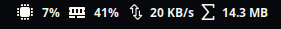
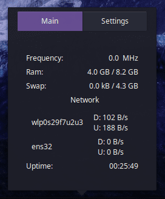
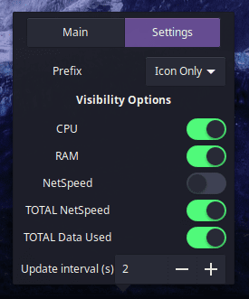

# System monitor applet
A budgie-desktop applet to show frequency, ram, swap, network.

## Notice: sorry, I don't use Budgie anymore

  

### Popover-main
  

### Popover-settings


---


## Dependencies
```
vala
gtk+-3.0 >= 3.18
budgie-1.0 >= 2
glib-2.0 >= 2.46.0
libpeas-1.0 >= 1.8.0
gobject-2.0
libgtop-2.0
gee-0.8
```

### Installing from source
```
meson build --prefix=/usr --buildtype=plain
ninja -C build
sudo ninja -C build install
```
